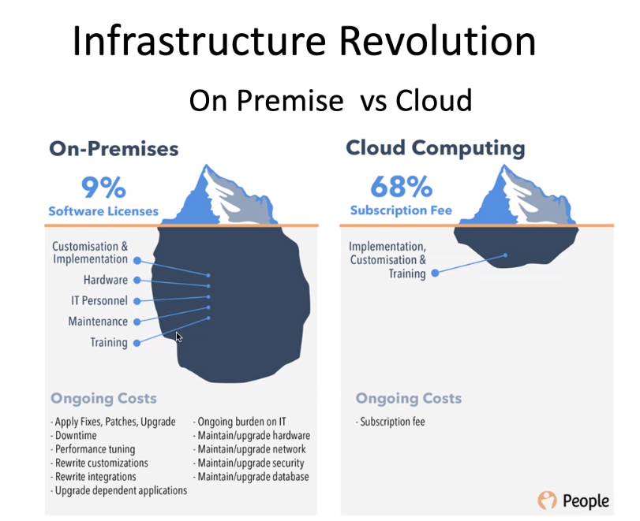

# DevOps

## History

- SW. Dev & Operations - Back in the day
- Web Dev. & Operations - Back in the day
 
- Updates took longer to role out
- Physical and hard obstacles
- Bugs took longer to fix
- Feedback-loop took longer
- Slow
 
- What mother board do you want?
- What memory
- What do you want runniung on it? Linux or Windows?
- Maybe you want a virtual machine?
- Linux! Great, what distro? Ubuntu, Debian, coreos?
- What IP Address are you going to set it to?
- You'll probably need a nice inverter
- Perfect now all you have to do it:
- Feed it power, add 1000 CPU at peak points
- Make backups of data
- Make physical backups of data
- Serve it to the different regions
- Clean the dust physically clean it
- Dont even get me started about security and updates

## Infrastructure Revolution

## What is DevOps

Practical Definitions

- A **collaboration** of Development (Dev) and Operations (Ops).
- A **culture** which promotes collaboration between Development and Operations Team to deploy code to production faster in an automated & repeatable way.
- A **practice** of development and operation engineers taking part together in the whole service lifecycle.
- A **approach** through which superior quality software can be developed quickly and with more reliability.
- A **allignment** of development and IT operations with better communication and collaboration.
 
Academics Definitions
 
A set of practices intended to reduce the time between committing a change to a system and the change being places into normal production while ensuring high quality.

- A set of practices - many ways of doing something
- Moving changes from development to production
  - Shorter time
  - Higher quality

## Challenges to DevOps Engineers

The four pillars

- Ease of use
- Flexibility
- Robustness
- Cost

A successful DevOps implemention turns challenges into benefits

## DevOps Principles

1. Customer-Centric Action
2. End-To-End Responsibility
3. Continuous Improvement
4. Automate Everything
5. Work as one team
6. Monitor and test everything

## Stages in DevOps lifecycle

- Continuous Development
- Continuous Testing
- Continuous Integration
- Continuous Deployment
- Continuous Monitoring

## DevOps Implementation

## Risk Register

## What a DevOps Engineer Does

